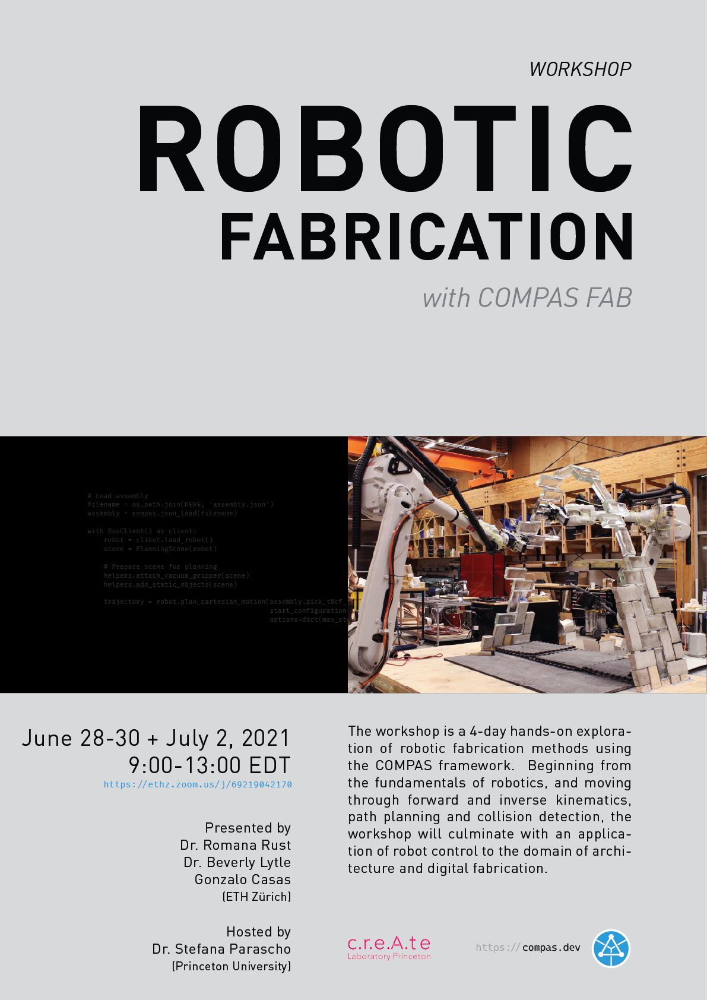

# Workshop: Robotic Fabrication with COMPAS FAB

## Princeton University

> 28-30 June + 2 July 2021

## Overview

* Intro
* Kinematics
* Path planning
* Scene and end effectors
* Pick and Place
* Assemblies
* Robot control

👉 [Slides](https://docs.google.com/presentation/d/12fdKOod3T_OaDoYalJOTHvTI0NZv-UTZKL0OpXUL2Kc/edit?usp=sharing)

## Examples

### Introduction

* Primitives
  * [Primitives](examples/001_primitives.py)
  * [Operations](examples/002_primitives_operations.py)
  * [Constructors](examples/003_primitives_constructors.py)
  * [Equivalences to built-ins](examples/004_primitives_equivalence.py)
  * [Transforms](examples/005_primitives_transforms.py)
* Shapes
  * [Shapes](examples/006_shapes.py)
  * [Shapes in Rhino](examples/007_shapes_rhino.py)
* Mesh datastructure
  * [Mesh in Rhino](examples/010_mesh_rhino.py)
  * [Mesh in Blender](examples/011_mesh_blender.py)
  * [Mesh in GHPython](examples/012_mesh_ghpython.py)
  * [Mesh from scratch](examples/013_mesh_from_scratch.py)
  * [Mesh stand-alone viewer](examples/014_mesh_plotter.py)
  * [Queries: vertex degree](examples/015_mesh_info_vertex_degree.py)
  * [Queries: vertices on boundary](examples/016_mesh_info_vertices_on_boundary.py)
  * [Queries: face neighbors](examples/017_mesh_info_face_neighbors.py)
  * [Queries: vertex neighbors](examples/018_mesh_info_vertex_neighbors.py)
  * [Queries: edge strip](examples/019_mesh_info_edge_strip.py)
  * [Queries: edge loop](examples/020_mesh_info_edge_loop.py)
  * [Vertex normals in Rhino](examples/021_mesh_vertex_normals_rhino.py)
  * [Flip cycles](examples/022_mesh_flip_cycles_rhino.py)
  * [Artists in Rhino](examples/023_mesh_rhino.py)
  * [Boolean operations with CGAL](examples/024_mesh_booleans.py)
  * [Boolean operations in Rhino](examples/025_mesh_booleans_rhino.py)

* Network datastructure
  * [Network from scratch](examples/030_network_from_scratch.py)
  * [Network in Rhino](examples/031_network_from_scratch_rhino.py)
  * [Network attributes](examples/032_network_from_scratch_rhino.py)
  * [Network stand-alone viewer](examples/032_network_plotter.py)
  * [Queries: node neighbors](examples/033_network_info_node_neighbors.py)
  * [Queries: shortest path](examples/034_network_info_shortest_path.py)
  * [Interactive network](examples/035_network_interactive.py)
  * [Serialization](examples/036_network_serialization.py)
  * [Serialization in Rhino](examples/037_network_serialization_rhino.py)
  * [Serialization of complex types](examples/038_network_serialization_complex_type.py)
  * [Network Koch snowflake](examples/039_network_koch.py)

* Remote Procedure calls
  * [Basic remote procedure call](examples/040_rpc_basic_example.py)

### Robotic fundamentals

* Frame
  * [Construct a frame](examples/101_several_ways_to_construct_frame.py)
  * [Point in frame](examples/102_point_in_frame.py)
  * [Frame in frame](examples/103_frame_in_frame.py)
  * [Box from world to local](examples/104_box_from_the_world_to_local.py)
  * [Box from world to local in Rhino](examples/105_box_from_the_world_to_local_rhino.py)

* Transformation
  * [Examples](examples/106_examples_transformation.py)
  * [Inverse transformation](examples/107_inverse_transformation.py)
  * [Pre-multiplication](examples/108_premultiply_transformations.py)
  * [Pre vs post multiplication](examples/109_pre_vs_post_multiplication.py)
  * [Matrix decomposition](examples/110_decompose_transformation.py)
  * [Transform point and vector](examples/111_transform_point_and_vector.py)
  * [Transform multiple](examples/112_transform_multiple.py)
  * [Change of basis](examples/113_change_basis_transformation.py)
  * [Transform between frames](examples/114_transformation_between_frames.py)
  * [Box from world to local in Rhino](examples/115_box_from_the_world_to_local_rhino.py)

* Rotation
  * [Construct a rotation](examples/116_several_ways_to_construct_rotation.py)
  * [Robot TCP orientations](examples/117_robot_tcp_orientations.py)
  * [Euler angles](examples/118_euler_angles.py)
  * [Axis angle](examples/119_axis_angle.py)
  * [Quaternions](examples/120_quaternion.py)

### Kinematics and Models

* Robot Model
  * [Visualize URDF in Rhino](examples/201_visualize_model_rhino.py)
  * [Visualize URDF with meshes in Rhino](examples/202_visualize_model_with_meshes_rhino.py)
  * [Load from local files in Rhino](examples/204_robot_from_local_rhino.py)
  * [Load from Github package](examples/205_robot_from_github.py)
  * [Load from Github package in Rhino](examples/206_robot_from_github_rhino.py)
  * [Load and manipulate in Grasshopper](examples/207_robot_artist_grasshopper.ghx)
  * [Load from ROS](examples/208_robot_from_ros.py)
  * [Define programmatically](examples/209_define_programmatically.py)
  * [Build your own model](examples/210_build_your_own_robot.py)

* Configuration
  * [Joint types](examples/211_joint_types.py)
  * [Construction and merge](examples/212_configuration.py)

* Kinematics
  * [Forward Kinematics](examples/213_forward_kinematics.py)
  * [Forward Kinematics in Rhino](examples/214_forward_kinematics_rhino.py)
  * [Inverse Kinematics](examples/215_inverse_kinematics.py)
  * [Inverse Kinematics in Rhino](examples/216_inverse_kinematics_rhino.py)
  * [Inverse Kinematics in Grasshopper](examples/217_ik.ghx)

### ROS and MoveIt

* ROS Basics
  * [Verify connection](examples/301_check_connection.py)
  * [Interconnected nodes: Listener](examples/302_ros_hello_world_listener.py)
  * [Interconnected nodes: Talker in Grasshopper](examples/303_ros_hello_world_talker.ghx)
  * [Interconnected nodes: Talker](examples/304_ros_hello_world_talker.py)

* ROS & MoveIt planning with UR5
  * [Load robot](examples/305_robot_from_ros.py)
  * [Load robot in Rhino](examples/306_robot_from_ros_rhino.py)
  * [Forward Kinematics](examples/307_forward_kinematics_ros_loader.py)
  * [Inverse Kinematics](examples/308_inverse_kinematics_ros_loader.py)
  * [Cartesian motion planning](examples/309_plan_cartesian_motion_ros_loader.py)
  * [Cartesian motion planning + graphs](examples/310_plan_cartesian_motion_ros_loader_viz.py)
  * [Free space motion planning](examples/311_plan_motion_ros_loader.py)
  * [Free space motion planning + graphs](examples/312_plan_motion_ros_loader_viz.py)
  * [Constraints](examples/313_constraints.py)

* Planning scene and end-effectors in MoveIt
  * [Load scene in Grasshopper](examples/314_planning_scene.ghx)
  * [Add objects to the scene](examples/315_add_collision_mesh.py)
  * [Append nested objects to the scene](examples/316_append_collision_meshes.py)
  * [Remove objects from the scene](examples/317_remove_collision_mesh.py)
  * [Attach tool](examples/410_attach_tool.py)
  * [Detach tool](examples/411_detach_tool.py)
  * [Cartesian motion planning with tool](examples/412_plan_cartesian_motion_with_attached_tool.py)

### Assemblies

* Pick and Place
  * [Simple Pick and Place in Grasshopper](examples/413_pick_and_place.ghx)

* Graphs and Orders
  * [Linear order](examples/501_linear_order.py)
  * [Color-mixing lattice](examples/502_color_mixing_lattice.py)
  * [Color-mixing lattice in Rhino](examples/503_color_mixing_lattice_rhino.py)
  * [Partial order](examples/504_partial_order.py)
  * [Network concepts](examples/505_network_concepts.py)
  * [Using NetworkX](examples/506_networkx.py)

* Assembly models
  * [Basic model of a network-based assembly class](examples/assembly.py)
  * [Network-based assembly planner](examples/600_assembly_planner.ghx)

* Sequence assignments
  * [Default sequence](examples/601_assign_default_sequence.py)
  * [Linear sorted sequence](examples/602_assign_linear_sequence.py)

* Scripted Assembly Planning
  * [Plan pick trajectory](examples/608_plan_pick_trajectory.py)
  * [Plan all brick placements](examples/609_plan_placements.py)
  * [Clear planning scene](examples/610_clear_planning_scene.py)
  * [Clear all trajectories](examples/611_clear_all_trajectories.py)

* Assembly visualization
  * [Grasshopper viewer](examples/620_assembly_viewer.ghx)

* Assembly Design for tomorrow!
  * [Assembly designs](examples/621_assembly_designs.ghx)

### Robot Control with COMPAS RRC

* Communication
  * [Hello World](examples/701_hello_world.py)
  * [Send instruction](examples/702_send.py)
  * [Send instruction with feedback (blocking)](examples/703_send_and_wait.py)
  * [Send instruction with deferred feedback (non-blocking)](examples/704_send_and_wait_in_the_future.py)

* Basic setup
  * [Set tool](examples/705_set_tool.py)
  * [Set work object](examples/706_set_work_object.py)
  * [Set acceleration](examples/707_set_acceleration.py)
  * [Set max speed](examples/708_set_max_speed.py)

* Motion instructions
  * [Get/Move to frame](examples/709_get_and_move_to_frames.py)
  * [Get/Move to joints (Configuration)](examples/710_get_and_move_to_joints.py)
  * [Get/Move to Robtarget](examples/711_get_and_move_to_robtarget.py)
  * [Move to home configuration](examples/712_move_to_home.py)

* Utilities
  * [No-op/ping](examples/713_no-op.py)
  * [Print Text on flex pendant](examples/714_print_text.py)
  * [Wait time](examples/715_wait_time.py)
  * [Stop/Pause program](examples/716_stop.py)
  * [Stopwatch on the robot](examples/717_watch.py)
  * [Custom instruction](examples/718_custom_instruction.py)

* Input/Output signals
  * [Read analog input](examples/719_input_analog.py)
  * [Read digital input](examples/720_input_digital.py)
  * [Read group input](examples/721_input_group.py)
  * [Set analog output](examples/722_output_analog.py)
  * [Set digital output](examples/723_output_digital.py)
  * [Set group output](examples/724_output_group.py)
  
* Brick assembly
  * [Work objects](examples/725_work_objects.py)
  * [Pick and Place bricks](examples/726_brick_placing.py)

## Requirements

* Minimum OS: Windows 10 Pro or Mac OS Sierra 10.12
* [Anaconda 3](https://www.anaconda.com/distribution/)
* [Docker Desktop](https://www.docker.com/products/docker-desktop) Docker Toolbox would also work but it's a bit more annoying. After installation on Windows, it is required to enable "Virtualization" on the BIOS of the computer.
* [Rhino 6/7 & Grasshopper](https://www.rhino3d.com/download)
* [Visual Studio Code](https://code.visualstudio.com/): Any python editor works, but we recommend VS Code + extensions [as mentioned in our docs](https://gramaziokohler.github.io/compas_fab/latest/getting_started.html#working-in-visual-studio-code-1)

## Installation

We use `conda` to make sure we have clean, isolated environment for dependencies.

First time using `conda`? Make sure you run this at least once:

    (base) conda config --add channels conda-forge

Clone this repository and create a new conda environment:

    (base) cd path/to/workshop_princeton_2021
    (base) conda env create -f environment.yml
    (base) conda activate fab21

Alternatively, create environment manually

The conda environment can also be manually created:

    (base) conda create -n fab21 python=3.8 compas_fab>=0.19.1 --yes
    (base) conda activate fab21

**Mac**

Also install `python.app` after activating the environment:

    (fab21) conda install python.app

### Verify installation

    (fab21) python -m compas

    Yay! COMPAS is installed correctly!

    COMPAS: 1.7.1
    Python: 3.8.10 | packaged by conda-forge | (default, May 11 2021, 06:25:23) [MSC v.1916 64 bit (AMD64)]
    Extensions: ['compas-fab', 'compas-slicer', 'compas-cgal', 'compas-rrc']

### Install on Rhino

    (fab21) python -m compas_rhino.install
    (fab21) python -m compas_rhino.install -v 7.0

### Update installation

To update your environment:

    (fab21) conda env update -f environment.yml
